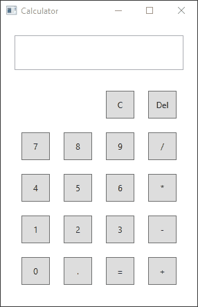

## WPF Calculator

A simple calculator built with C# and WPF

Currently the calculator can only do one operation at a time.
There is also no way to input a value that has decimals, but the calculator can handle doing math with decimals.
It is also possible to overflow the calculator if you enter a number that is too big or get a result that is too big.
